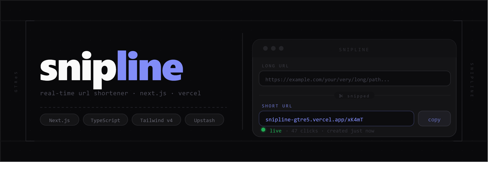

# Snipline

Real-time URL shortener built with **Next.js 16** (App Router), TypeScript, and Tailwind CSS v4 — ready to deploy on Vercel in minutes.

Paste a long link, get a short one back instantly, with optional custom aliases, live click tracking, and a full manifest of every link you've created.

[](https://nextjs.org/)
[](https://www.typescriptlang.org/)
[](https://tailwindcss.com/)
[](https://www.framer.com/motion/)
[](https://upstash.com/)
[](LICENSE)

---

## Overview

| File / Folder | Purpose |
|---|---|
| `src/app/page.tsx` | Home page — hero section and the shortener app |
| `src/app/[code]/page.tsx` | Server-side redirect: lookup → increment click counter → redirect |
| `src/app/api/shorten/route.ts` | `POST` — validate URL, generate or check alias, store the mapping |
| `src/app/api/stats/route.ts` | `POST` — batch-fetch live click counts for a list of codes |
| `src/lib/store.ts` | Storage abstraction — Upstash Redis in production, in-memory in dev |
| `src/lib/codegen.ts` | Nanoid-based 7-character short-code generator (unambiguous alphabet) |
| `src/lib/validators.ts` | URL normalisation and alias validation |
| `src/hooks/use-link-history.ts` | `localStorage` persistence and live click-count polling |
| `src/context/theme-provider.tsx` | Flicker-free light / dark theme, persisted across sessions |

**Features**

`url shortening` · `custom aliases` · `live click tracking` · `rate limiting` · `in-memory dev fallback` · `light / dark theme` · `copy to clipboard` · `Framer Motion animations` · `Vercel-ready`

---

## Prerequisites

- Node.js 18+ and npm
- (Optional, recommended for production) An [Upstash](https://upstash.com/) account for a free Redis database

---

## Installation

```bash
git clone https://github.com/GTRe5/Snipline.git
cd Snipline

npm install
npm run dev
```

Open http://localhost:3000. Without any configuration, links are stored in memory — fine for a local tryout, but they reset on every dev-server restart.

---

## Workflow

### Step 1 — Local Development

Start the dev server:

```bash
npm run dev
```

The in-memory store activates automatically when no Redis credentials are present — no `.env` file required to get started.

**Tunable constants**

| Constant | File | Default | Description |
|---|---|---|---|
| `CODE_LENGTH` | `src/lib/codegen.ts` | `7` | Length of generated short codes |
| `ALPHABET` | `src/lib/codegen.ts` | 57 chars | Characters used in codes — 0/O, 1/l/I excluded to avoid visual ambiguity |
| `MAX_URL_LENGTH` | `src/lib/validators.ts` | `2048` | Maximum accepted URL length |
| `RATE_LIMIT_MAX` | `src/lib/store.ts` | `30` | Max links created per IP per window |
| `RATE_LIMIT_WINDOW_MS` | `src/lib/store.ts` | `600 000` (10 min) | Rate-limit sliding window |
| `MAX_HISTORY` | `src/hooks/use-link-history.ts` | `25` | Links kept in the browser ledger |
| `POLL_INTERVAL_MS` | `src/hooks/use-link-history.ts` | `8 000` (8 s) | How often click counts are refreshed from the server |

---

### Step 2 — Persistent Storage

Serverless functions on Vercel don't share memory between invocations — links disappear on cold starts unless a real database is connected. Upstash Redis has a free tier and pairs natively with Vercel.

**Connect Upstash (two options)**

Option A — through Vercel (easiest):
In your Vercel project dashboard go to **Storage → Create Database → Upstash for Redis**.
Vercel automatically injects `UPSTASH_REDIS_REST_URL` and `UPSTASH_REDIS_REST_TOKEN` into your environment.

Option B — manually at [console.upstash.com](https://console.upstash.com), then add the two values yourself.

For local development, copy those values into `.env.local`:

```bash
KV_REST_API_URL=https://your-db.upstash.io
KV_REST_API_TOKEN=your_token_here
```

`src/lib/store.ts` detects the credentials automatically and switches from in-memory to Redis — no code changes needed. Vercel's legacy `KV_REST_API_*` variable names are also accepted.

---

### Step 3 — Deploy to Vercel

**Option A — Vercel CLI**

```bash
npm install -g vercel
vercel
```

**Option B — GitHub**

1. Push this repository to GitHub.
2. Go to [vercel.com/new](https://vercel.com/new) and import the repository.
3. Vercel auto-detects Next.js — no build configuration required.
4. Add the Upstash Redis integration (Step 2) before or after the first deploy.

---

## Live Demo

**[snipline-gtre5.vercel.app](https://snipline-gtre5.vercel.app)**

> Custom aliases, live click counts, and the full link ledger — all updating in real time.

---

## How it works

**Shortening**

`POST /api/shorten` validates the submitted URL (normalising missing protocols, rejecting non-http/https schemes), then either generates a 7-character code using nanoid's custom alphabet or checks a user-supplied alias for availability. The mapping is stored and the response includes the full `LinkRecord`. Requests are rate-limited per IP (30 links / 10 minutes).

**Redirecting**

Visiting `/{code}` triggers a Next.js Server Component that looks up the destination, increments its click counter, and issues a redirect — entirely server-side, before any HTML reaches the browser.

**Real-time updates**

The browser persists every created link to `localStorage` and polls `/api/stats` every 8 seconds to refresh click counts. The ledger reflects redirects that happen anywhere — another tab, another device, or someone else following your link.

---

## Project Structure

```
Snipline/
├── src/
│   ├── app/
│   │   ├── page.tsx                    # Home page (hero + shortener app)
│   │   ├── layout.tsx                  # Fonts, theme bootstrap, header/footer
│   │   ├── globals.css                 # Design tokens (colors, fonts, dark mode)
│   │   ├── not-found.tsx               # Branded 404, shown for unknown codes
│   │   ├── [code]/page.tsx             # Lookup → click increment → redirect
│   │   └── api/
│   │       ├── shorten/route.ts        # POST — create a short link
│   │       └── stats/route.ts          # POST — batch-fetch click counts
│   ├── components/
│   │   ├── site-header.tsx
│   │   ├── site-footer.tsx
│   │   ├── theme-toggle.tsx
│   │   ├── status-dot.tsx
│   │   └── shortener/
│   │       ├── shortener-app.tsx       # Wires form + ledger via shared state
│   │       ├── shortener-card.tsx      # URL input, alias toggle, submit button
│   │       ├── link-result.tsx         # Animated "snipped" result card
│   │       ├── link-ledger.tsx         # Recent-links manifest table
│   │       ├── ledger-row.tsx          # Individual row with copy + remove
│   │       └── copy-button.tsx
│   ├── hooks/
│   │   └── use-link-history.ts         # localStorage + click-count polling
│   ├── context/
│   │   └── theme-provider.tsx          # Light/dark theme, no flash on load
│   └── lib/
│       ├── store.ts                    # Redis or in-memory storage
│       ├── validators.ts               # URL + alias validation
│       ├── codegen.ts                  # Short-code generation
│       └── types.ts                    # Shared TypeScript interfaces
├── next.config.ts
├── tsconfig.json
├── package.json
└── README.md
```

---

## Stack

| Technology | Role |
|---|---|
| [Next.js 16](https://nextjs.org/) (App Router) | Framework — Server Components, Route Handlers, server-side redirects |
| [TypeScript](https://www.typescriptlang.org/) | Type safety throughout the entire codebase |
| [Tailwind CSS v4](https://tailwindcss.com/) | Styling, built on a custom design-token system in `globals.css` |
| [Framer Motion](https://www.framer.com/motion/) | Micro-interactions — result reveal, ledger row enter/exit animations |
| [nanoid](https://github.com/ai/nanoid) | Collision-safe short-code generation with a custom alphabet |
| [Upstash Redis](https://upstash.com/) | Persistent key-value store (optional; automatic in-memory fallback in dev) |
| [Vercel](https://vercel.com/) | Hosting — zero-config Next.js deployment |

---

## Customizing

| What to change | Where |
|---|---|
| Code length and character set | `src/lib/codegen.ts` → `CODE_LENGTH`, `ALPHABET` |
| Colors, fonts, dark mode | `src/app/globals.css` |
| Rate-limit thresholds | `src/lib/store.ts` → `RATE_LIMIT_MAX`, `RATE_LIMIT_WINDOW_MS` |
| Ledger size and poll frequency | `src/hooks/use-link-history.ts` → `MAX_HISTORY`, `POLL_INTERVAL_MS` |
| Reserved alias paths | `src/lib/validators.ts` → `RESERVED_PATHS` |

---

## License

This project is released under the [MIT License](LICENSE).